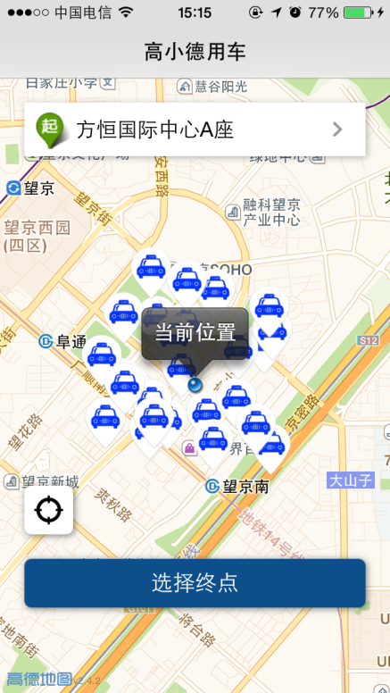
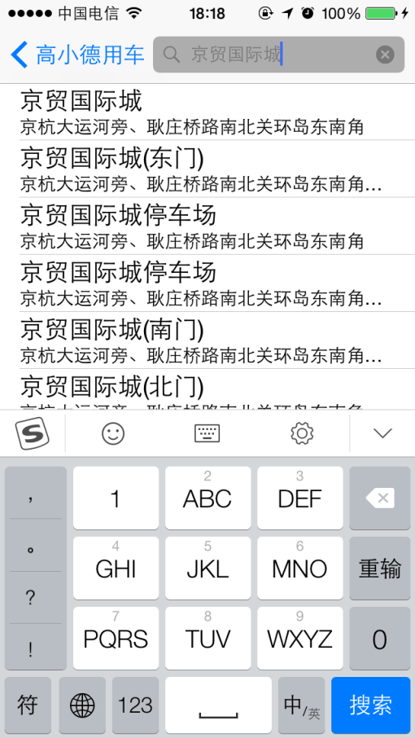
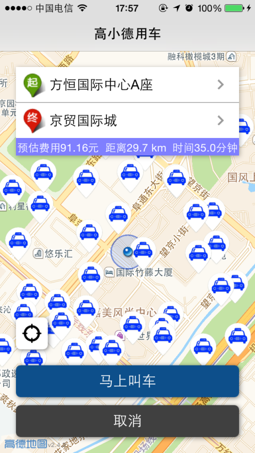

德德用车
=======
高德地图开放平台出行类解决方案-乘客端（iOS）

### 描述

使用高德地图开放平台相关SDK开发的出行类app乘客端的Demo。

- [出行类解决方案]http://lbs.amap.com/smart/car/
- [iOS相关SDK]http://lbs.amap.com/api/ios-sdk/summary/
- [开放平台社区]http://lbsbbs.amap.com/portal.php

### 说明

Demo中使用了高德地图iOS平台的3D地图SDK和搜索SDK。
DDSearchManager 类封装了搜索SDK的相关功能。
DDDriverManager 用于管理司机相关操作。

### 截图效果

